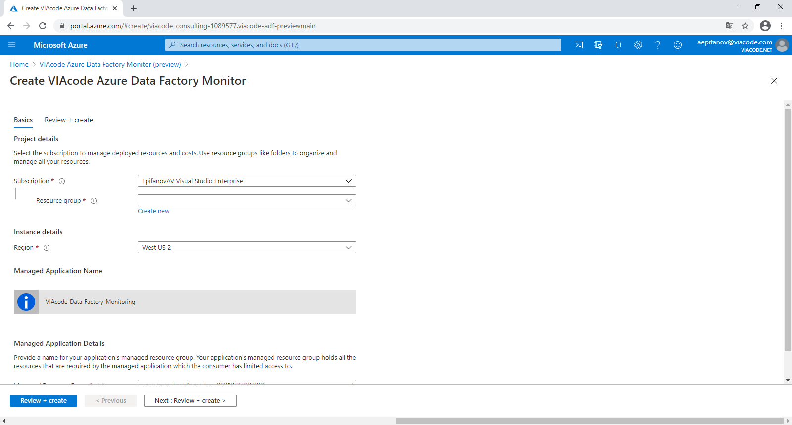
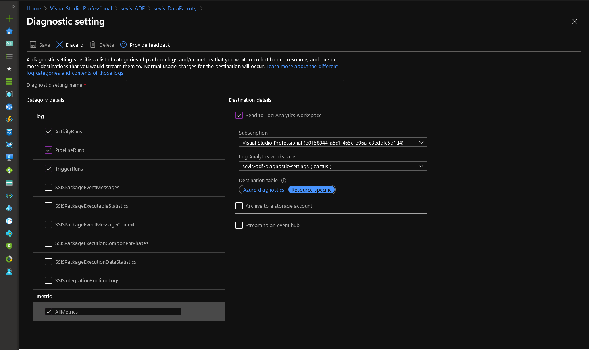

# Overview
Azure Data Factory Monitoring is the unique tool from VIAcode, integrated with the Azure Portal providing the monitoring capabilities for Azure Data Factory. It includes monitoring scenarios for Azure Data Factory Activities, Pipelines and Triggers. 

This application enterprise IT team will be able to quickly detect and diagnose Azure Data Factory service and workflows failure and recover it in no time. 
# Installation and Setup
## Deployment
Deployment does not require any additional parameters.  
  
When the deployment succeeds, a new Managed application is deployed to the RG you provided.
Additionally, the following resources are deployed in the managed RG:

| Name                                                   | Type                 | Description                                                                                                                                                                                                                     |
|--------------------------------------------------------|----------------------|---------------------------------------------------------------------------------------------------------------------------------------------------------------------------------------------------------------------------------|
| api-*                                                  | Function App         | Main monitoring worker. It discovers available ADF instances and deploys monitoring resources for each of them. Moreover, it provides an API for Managed Application UI to let you see monitored ADF instances and manage them |
| sf-*                                                   | App Service plan     | App service plan for the api-* function app.                                                                                                                                                                                    |
| sa*                                                    | Storage account      | The function app uses it for its internal needs. Moreover it stores other internal data - ADF instances monitoring state, etc.                                                                                                  |
| ai-*                                                   | Application Insights | Used for API diagnostics and hosts troubleshooting guides                                                                                                                                                                       |
| * (VIAcode Data Factory Runtime Troubleshooting Guide) | Workbook             | ADF integration runtime troubleshooting guide                                                                                                                                                                                   |
| * (VIAcode Azure Data Factory Troubleshooting Guide)   | Workbook             | ADF pipeline failures troubleshooting guide                                                                                                                                                                                     |
## Additional Setup
When the solution is just deployed, the monitoring worker does not have any access to your environment, so it will do nothing. You should provide it with a read permission to your subscription(s) as it is mention in the deployment UI.
Go to the deployed managed application and open the Parameters and Outputs blade. Copy the value of the monitoring Identity output.  
< screenshot here >  
Provide this identity with a Reader role to your subscription ([more info](https://docs.microsoft.com/en-us/azure/active-directory/managed-identities-azure-resources/howto-assign-access-portal))

## Configure ADF Diagnostic Settings
Configure diagnostic setting to send platform logs and metrics to Log Analytics Workspace.

1. Go to Log Analytics workspace on the blade menu.
2. Under Monitoring section select "Diagnostic Settings". Diagnostic settings menu will opens.
3. Click on "+Add diagnostic Setting".
4. Specify a name for the Diagnostic setting. 
5. Select the required categories to send.
6. Select the subscription that contains VIAcode-Azure-Data-Factory monitoring and workspace itself.
7. Save Diagnostic setting configuration.

# Out of the Box Experience
Once the setup is complete, you can see all available ADF instances on the Data Factories blade in the app UI.  
  
When the instance is just discovered its monitoring state is Pending. Once all the monitoring resources for this instance are deployed, the state changes to Enabled.
The monitoring solution provides a bunch of alert rules for each ADF instance and two troubleshooting guides.
## Alert Rules
| Name                                                                                                 | Frequency  | Time Window | Description                                              |
|------------------------------------------------------------------------------------------------------|------------|-------------|----------------------------------------------------------|
| Azure Data Factory Failed Pipeline Runs Count greater than or equal 1 in 1 minute                    | 1 minute   | 1 minute    | Fires whenever any pipeline fails during the last minute |
| Azure Data Factory Failed Trigger Runs Count greater than or equal 1 in 1 minute                     | 1 minute   | 1 minute    | Fires whenever any trigger fails during the last minute  |
| Azure Data Factory Failed Activity Runs Count greater than or equal 1 in 1 minute                    | 1 minute   | 1 minute    | Fires whenever any activity fails during the last minute |
| Azure Data Factory Integration runtime CPU Utilization Avg Percentage greater than 85 for 15 minutes | 15 minutes | 15 minutes  | Fires when integration runtime is constantly overloaded  |
## Troubleshooting Guides
Troubleshooting guides help you to understand what is exactly wrong with your ADF instances or its pipelines. When any of the above mentioned alerts fires, its description will contain a link to one of the troubleshooting guides.
### Pipeline troubleshooting guide.
When an alert is about a pipeline/trigger/activity failure, it will lead you to the pipeline troubleshooting guide. Here is what you can do here:
1. Examine the recently failed pipelines (or pipelines with failed activities or all pipelines):
    * Click on one of the pipelines and have a look at the details below.
    * Overview the activity log to see which activity executed before the failure and which exact activity failed.
    * Click the failed activity to see the detailed error message.
2. If you see that the execution sequence is wrong or the error message is quite clear and you know what to do, scroll down and click the `View Pipeline` button to edit the pipeline and fix the issue.
3. If the error message does not help, have a look at the integration runtime metrics collected during the selected run.  
   The metrics might show that your integration runtime is overloaded and might need to be scaled up.
   Other way is to set up the query that the pipeline executes to make it more lightweight. Click the `View Runtime` link in the bottom of the guide, select the failed activity and set it up.
4. If the error message is unclear and the metrics show normal values, you may need to have a more detailed overview of the failed run. Click `View Run` to see the run details in a Data Factory UI  

### Integration runtime troubleshooting guide.
When an alert is about an integration runtime overload, it will lead you to the integration runtime troubleshooting guide. Here is what you can do here:
1. Examine the integration runtime metrics.
2. Select one of the integration runtime nodes - the charts will be filtered by the node.
3. If the runtime VM is available, you will see the tile with the VM details.
4. Depending on the data you see in the metric charts, you may decide to scale up your VM - click the `Resize` link on the tile, or make some other VM setup (e.g. restart it) - click `Overview` link  

# Solution Management
## Disable Monitoring for a Specific Instance
Out of the box the monitoring worker will enable monitoring for each ADF instance it discovers. You can disable monitoring for a specific instance. To do it:
1. Open the Data Factories blade in the app UI. 
2. Select the ADF instance you do not want to monitor
3. Click `Enable/Disable` button on the top.  
 
Once you do it, the monitoring state will change di Disabled and all alert rules connected to this instance will be deleted.

If you want to enable the monitoring back, you should select the instance and click again `Enable/Disable` button. The state will change to Pending and then to Enabled in about 5 minutes.
